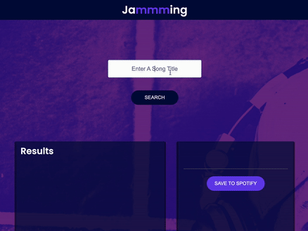

# Jamming

## A react App using Spotify API

* ### Features

Users can search for songs by song title.

You can also include functionality to search by other attributes like artist’s name, genre, etc.

Users can see information about each song like title, artist, and album for songs they queried.

You can also include other information – the design is up to you.

Users can export their custom playlist to their personal Spotify account.

